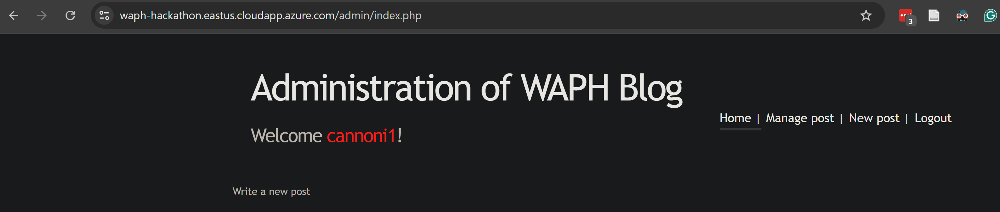
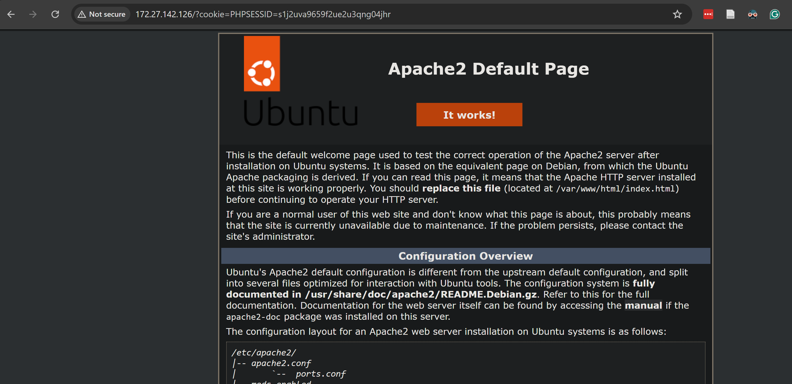
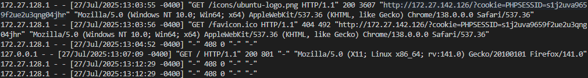
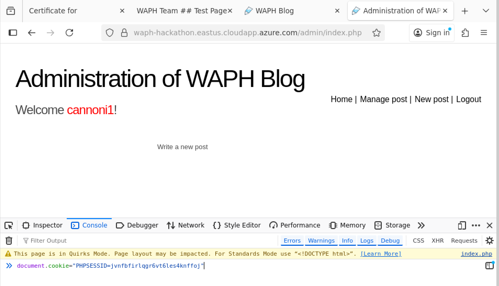
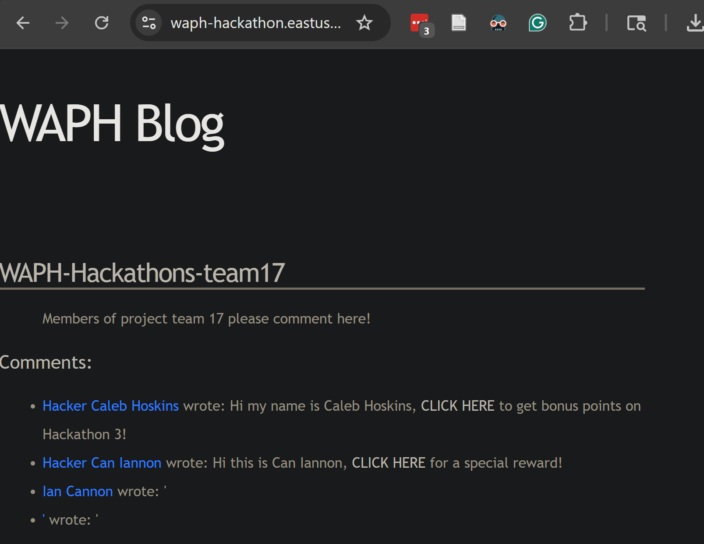

# WAPH-Web Application Programming and Hacking

## Instructor: Dr. Phu Phung

## Student

**Name**: Ian Cannon

**Email**: [mailto:cannoni1@udayton.edu](cannoni1@udayton.edu)

**Short-bio**: Ian Cannon interests in Reinforcement Learning for Autonomous Control. 

## Repository Information

Respository's URL: [https://github.com/Spiph/WebAppDev](https://github.com/Spiph/waph-cannoni1)

This is a public repository for Ian Cannon to store all code from the course. The organization of this repository is as follows.

## Hackathon 3

### 1. Attacker: XSS code injection

#### 2. Victim: log in

Log in to the application

#### 3. Victim: Click malicious comment

#### 4. Attacker: steal cookie

#### 5. Attacker: use stolen cookie to get admin access

By inputting `document.cookie="PHPSESSID=jvnfbfirlqgr6vt6les4knffoj"`, I was successfully able to use the victim's cookie on my attacker browser

#### Bonus: 

The page is not vulnerable to sql injection attacks because posting `'` did not cause any errors to occur. This means that there are countermeasures against sql injection attacks.

## Video

See my hackathon video at https://github.com/Spiph/waph-spiph/blob/main/hackathons/hackathon3/Hackathon3_demo.mkv

