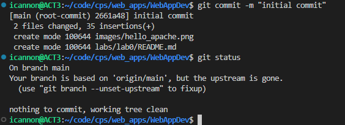

# WAPH-Web Application Programming and Hacking

## Instructor: Dr. Phu Phung

## Student

**Name**: Ian Cannon

**Email**: [mailto:cannoni1@udayton.edu](cannoni1@udayton.edu)

**Short-bio**: Ian Cannon interests in Reinforcement Learning for Autonomous Control. 

## Repository Information

Respository's URL: [https://github.com/Spiph/WebAppDev](https://github.com/Spiph/WebAppDev)

This is a public repository for Ian Cannon to store all code from the course. The organization of this repository is as follows.

### Labs 

[Hands-on exercises in lectures](labs) 

  - [Lab 0](labs/lab0): Development Environment Setup 

  Hello Apache

  

Git
  

  I already had git set up in my WSL instance so everything worked out there. I learned how to reference images in a different directory - I want to track everything in the images folder for future labs.

### Hackations

Hands-on hacking exercises

### Individual Projects

### Team Project
