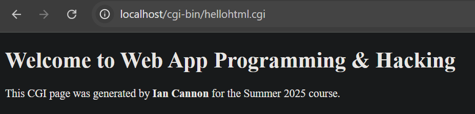
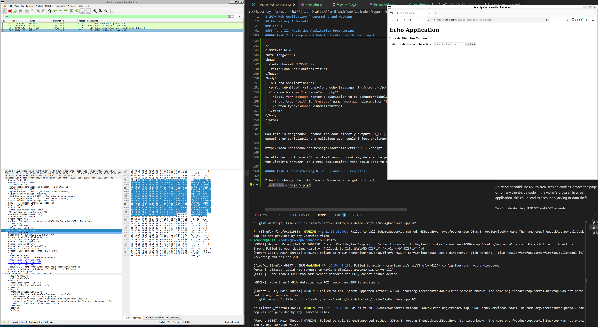

# WAPH-Web Application Programming and Hacking

## Instructor: Dr. Phu Phung

## Student

**Name**: Ian Cannon

**Email**: [mailto:cannoni1@udayton.edu](cannoni1@udayton.edu)

**Short-bio**: Ian Cannon interests in Reinforcement Learning for Autonomous Control. 


## Repository Information

Respository's URL: [https://github.com/Spiph/WebAppDev](https://github.com/Spiph/WebAppDev)

This is a public repository for Ian Cannon to store all code from the course. The organization of this repository is as follows.

### Lab 1

#### Part I: The Web and HTTP Protocol

##### Task 1. Get familiar with Wireshark and HTTP protocol
I installed wireshark and used it with sudo privledges. After specifying that I want it to filter for HTTP messages, I opened firefox on WSL and entered a simple website to study the traffic, `http://example.com/index.html`. 

This is the request:


Here is the response


And this is the HTTP stream:


##### Task 2. Understanding HTTP using telnet and Wireshark

I used telnet to send minimal HTTP requests for wireshark to examine. Here are the screenshots to prove my epic feat.

Wireshark with Telnet in terminal


HTTP Request message in Wireshark using telnet


You can see here that the telnet request contains only:
```
GET / HTTP/1.1
Host: example.com
```
why a typical browser-generated request contains additional headers such as User-Agent, Accept, Accept-Language, and Accept-Encoding.

Here is the response in Wireshark. I also saw the same output in my terminal.


The server’s response to the telnet request is essentially identical to what it returns to the browser. All standard response headers (Date, Server, Content-Type, Content-Length, etc.) and the HTML body appear the same.

Here is what I get:


#### Part II. Wasic Web Application Programming

##### Task 1. CGI Web Applications in C

After making sure gcc was installed and setting up helloworld.c, I used gcc to create a helloworld. Then I enabled Apache’s cgid module (`sudo a2enmod cgid`) and restarted Apache. I also had to copy helloworld.cgi to /usr/lib/cgi-bin. I used the cgi file and then confirmed it is running locally:


Following the instructions and the same process as I did in part a, I was able to produce the following html page:



here is the code block I used to do it. It just prints out the required lines.

```c
#include <stdio.h>

int main(void) {
    // Send the HTTP Content-Type header for HTML
    printf("Content-Type: text/html; charset=utf-8\n\n");

    // Print the HTML DOCTYPE and root elements
    printf("<!DOCTYPE html>\n");
    printf("<html lang=\"en\">\n");
    printf("<head>\n");
    printf("    <meta charset=\"UTF-8\">\n");
    printf("    <meta name=\"viewport\" content=\"width=device-width, initial-scale=1.0\">\n");
    printf("    <title>Web App Programming & Hacking — Ian Cannon</title>\n");
    printf("</head>\n");
    printf("<body>\n");

    // Page heading and paragraph (as per W3Schools template)
    printf("    <h1>Welcome to Web App Programming &amp; Hacking</h1>\n");
    printf("    <p>This CGI page was generated by <strong>Ian Cannon</strong> for the Summer 2025 course.</p>\n");

    // Optionally, you can add more HTML here (images, links, etc.)
    printf("</body>\n");
    printf("</html>\n");

    return 0;
}
``` 

##### Task 2. A simple PHP Web Application with user input

Here is the php output with all the server info:


and accompanying code:
```php
<?php
// Show PHP configuration information
phpinfo();
?>

<!DOCTYPE html>
<html lang="en">
<head>
  <meta charset="UTF-8">
  <title>Hello World PHP</title>
</head>
<body>
  <h1>Hello World PHP from Ian Cannon</h1>
  <p>This page also displays the server`s PHP configuration above.</p>
</body>
</html>
```

here is my echo output:


and code block:
```php
<?php
// echo.php: Echo back the “message” parameter from the URL
if (isset($_GET['message'])) {
    $message = $_GET['message'];
} else {
    $message = '';
}
?>
<!DOCTYPE html>
<html lang="en">
<head>
  <meta charset="UTF-8" />
  <title>Echo Application</title>
</head>
<body>
  <h1>Echo Application</h1>
  <p>You submitted: <strong><?php echo $message; ?></strong></p>
  <form method="get" action="echo.php">
    <label for="message">Enter a submission to be echoed:</label>
    <input type="text" id="message" name="message" placeholder="Enter a submission" />
    <button type="submit">Submit</button>
  </form>
</body>
</html>
```

How this is dangerous: Because the code directly outputs `$_GET['message']` into the HTML without any escaping or sanitization, a malicious user could inject arbitrary JavaScript. For example:
```
http://localhost/echo.php?message=<script>alert('XSS')</script>
```
An attacker could use XSS to steal session cookies, deface the page, or run any client-side code in the victim’s browser. In a real application, this could lead to account hijacking or data theft.

##### Task 3 Understanding HTTP GET and POST requests

I had to change the interface on Wireshark to get this output:


Here is the response:



I used the same address to create a POST message using curl:


And here is the response:


The main difference between the GET and POST requests is where the message parameter is placed (URL query string vs. request body) and the presence of Content-Type/Content-Length headers on POST. The server’s responses are nearly identical. They differ only in the specific echoed text embedded in the HTML body and thus in their content‐length.