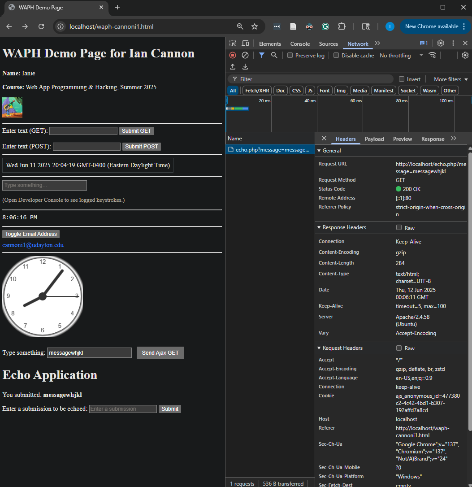
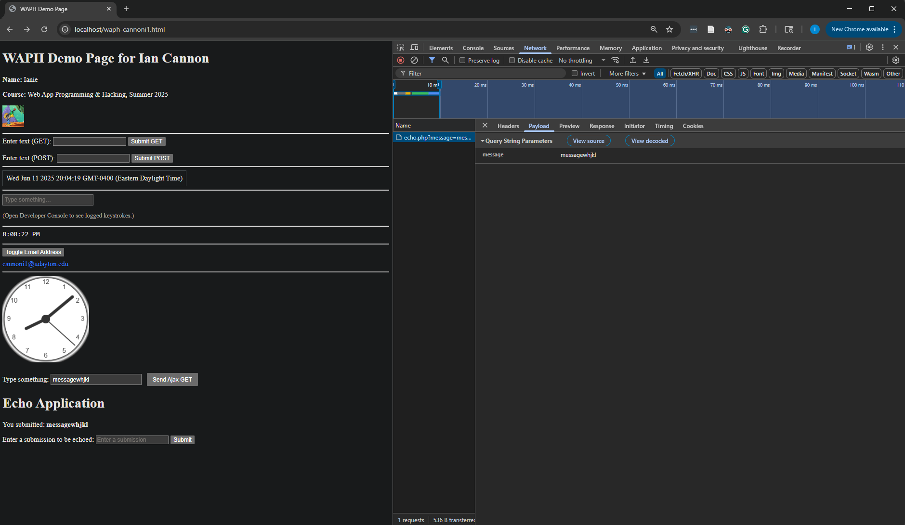

# WAPH-Web Application Programming and Hacking

## Instructor: Dr. Phu Phung

## Student

**Name**: Ian Cannon

**Email**: [mailto:cannoni1@udayton.edu](cannoni1@udayton.edu)

**Short-bio**: Ian Cannon interests in Reinforcement Learning for Autonomous Control. 

## Repository Information

Respository's URL: [https://github.com/Spiph/WebAppDev](https://github.com/Spiph/WebAppDev)

This is a public repository for Ian Cannon to store all code from the course. The organization of this repository is as follows.

### Lab 2

#### Part 1

#### Part 2

##### a. stands for Ajax

##### b. CSS

See how future images for style change. style2 gang for life

##### c. jQuery

You can see here that the GET message is similar to Ajax

But the POST does not have a message:

It is instead in the payload:

##### d. Web API Integration

Wana hear a joke? Every time you refresh, this page loads a new programming joke

I also added a fun title in everyone's favorite font

Now the fetch api.

These seem to overestimate ages by a long shot. I wonder how old this data is.