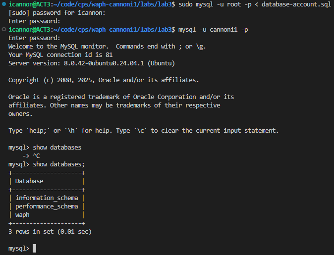
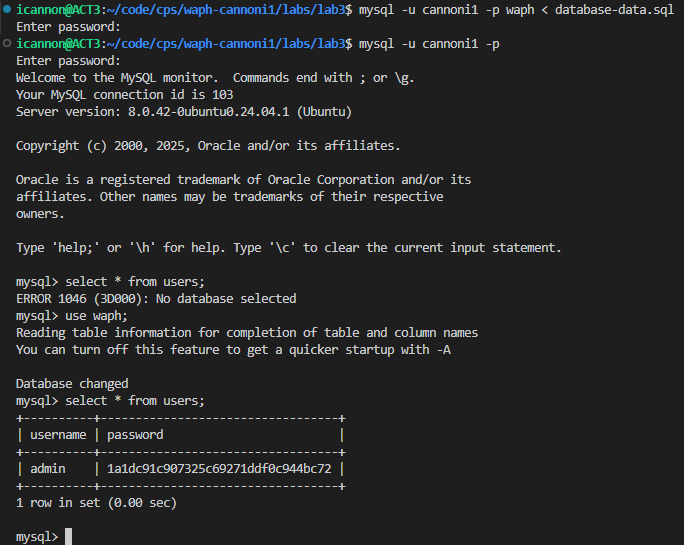
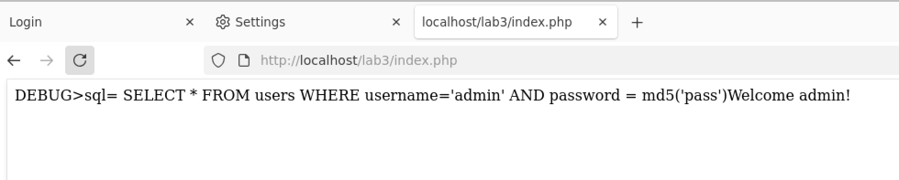
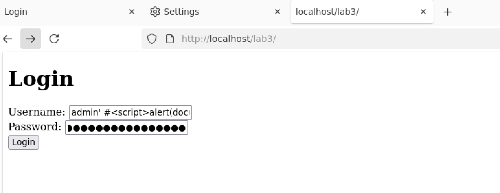
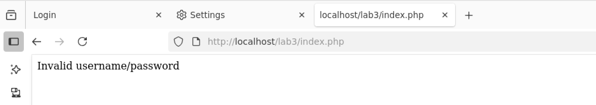

# WAPH-Web Application Programming and Hacking

## Instructor: Dr. Phu Phung

## Student

**Name**: Ian Cannon

**Email**: [mailto:cannoni1@udayton.edu](cannoni1@udayton.edu)

**Short-bio**: Ian Cannon interests in Reinforcement Learning for Autonomous Control. 

## Repository Information

Respository's URL: [https://github.com/Spiph/WebAppDev](https://github.com/Spiph/WebAppDev)

This is a public repository for Ian Cannon to store all code from the course. The organization of this repository is as follows.

### Lab 3

#### a. Database Setup and Management 

I created `waph` and the non-root user `cannoni1`

[database-account](database-account.sql)

Then I created an admin account

[database-data](database-data.sql)

#### b. A Simple (Insecure) Login System with PHP/MySQL

[form](form.php) 

[index](index.php)

#### c. Performing XSS and SQL Injection Attacks

Following the instructions from the checkin, here is my attack: `admin' #`

And the output from the attack

The SQL injection attack works because the application directly inserts user input into the database query without validation. The system concatenates the username and password into the SQL string, which allows an attacker to alter the query's logic.

Original Query Structure:

SQL

`SELECT * FROM users WHERE username='USER_INPUT' AND password = md5('PASSWORD_INPUT')`
Attacker's Input: The payload used is admin' #.

Altered Query: When this input is inserted, the query sent to the database becomes:

`SELECT * FROM users WHERE username='admin' #' AND password = md5('any_password')`

How it Bypasses Authentication:

The single quote (') after admin closes the username value.

The hash symbol (#) acts as a comment character in MySQL, telling the database to ignore everything that follows it.

As a result, the `AND password = ...` part of the query is completely ignored. The database executes the simplified, valid query `SELECT * FROM users WHERE username='admin'`, finds the admin user, and logs the attacker in without a valid password.

Cross-site Scripting (XSS) Vulnerability Explanation
The Cross-site Scripting (XSS) vulnerability exists because the application echoes user input directly back to the browser in the HTML response without proper sanitization.

When a user successfully logs in, the welcome message is generated by taking the username from the 

$_POST variable and printing it to the page. Since the SQL injection attack allows malicious code to be part of the "username," that code is then executed by the browser.

Vulnerable Code:

`<h2> Welcome <?php echo $_POST['username']; ?> !</h2>`
Attacker's Input: The full payload was `admin' #`.

HTML Output: After the SQLi logs the attacker in, the server sends the following unsanitized HTML to the browser:

`<h2> Welcome admin' # !</h2>`
Browser Execution: The browser parses this HTML, sees the `<script>` tag, and executes the JavaScript inside it. This causes the alert box to appear, displaying the session cookie, as shown in the successful attack screenshot.

#### d. Prepared Statement Implementation

Security Analysis
Explanation of Prepared Statements
Prepared statements prevent SQL injection by strictly separating the SQL query's structure from the data it uses. The process works in two main stages:

Prepare: An SQL statement template containing placeholders (?) is sent to the database server. The database parses, compiles, and optimizes this query structure without any user input.

Execute: The user-supplied data is sent to the database separately. The database then binds this data to the pre-compiled template, treating it exclusively as data, not as executable code.

Because the query's logic is already compiled before the user's input is introduced, malicious commands like 

' or # cannot alter the query's intent and are simply treated as part of the string to be matched.

Implementation of Output Sanitization
To mitigate the Cross-site Scripting (XSS) risk, the output must be sanitized before being rendered in the browser. This is done using the htmlspecialchars() function, which converts characters that have special meaning in HTML (like < and >) into their HTML entity equivalents.

Revised Code: The welcome message is changed to sanitize the username.

`<h2> Welcome <?php echo htmlspecialchars($_POST['username']); ?> !</h2>`
Explanation: By wrapping the output in htmlspecialchars(), an input like <script> is converted to &lt;script&gt;. The browser renders this as plain text instead of executing it as a script tag, effectively neutralizing the XSS attack.

Discussion of Other Programming Flaws
The current code still has potential flaws that should be addressed for more secure and robust programming:

Handling Empty Inputs: The code does not check if the username or password fields are empty before querying the database. This is inefficient and could lead to unexpected behavior. A proper implementation should validate that the inputs are not empty on the server side before proceeding with the database query.

Database Error Handling: While there is a check for the initial database connection, there is no error handling for subsequent operations like $stmt->prepare() or $stmt->execute(). If these functions fail, the script could crash or expose sensitive error information that could be useful to an attacker. Each step should be checked for failure to handle errors gracefully.

Username Matching: The query WHERE username = ? is often case-sensitive, depending on the database's configuration. This means a user who signed up as "Admin" could not log in as "admin." For a more user-friendly system, you might want to enforce case-insensitive matching by converting both the input and the database column to the same case during the comparison (e.g., WHERE LOWER(username) = LOWER(?)).

