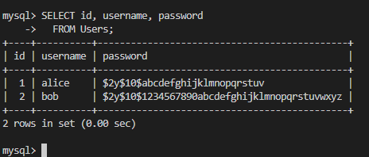

# WAPH-Web Application Programming and Hacking

## Instructor: Dr. Phu Phung

## Student

**Name**: Ian Cannon

**Email**: [mailto:cannoni1@udayton.edu](cannoni1@udayton.edu)

**Short-bio**: Ian Cannon interests in Reinforcement Learning for Autonomous Control. 

## Repository Information

Respository's URL: [https://github.com/Spiph/WebAppDev](https://github.com/Spiph/WebAppDev)

This is a public repository for Ian Cannon to store all code from the course. The organization of this repository is as follows.

### Lab 3

#### a. Database Setup and Management 

I created `secure_app` and the non-root user `webuser`

[database-account](database-account.sql)

passwords are securely hashed

[database-data](database-data.sql)

#### b. A Simple (Insecure) Login System with PHP/MySQL

[form](form.php) 

[index](index.php)