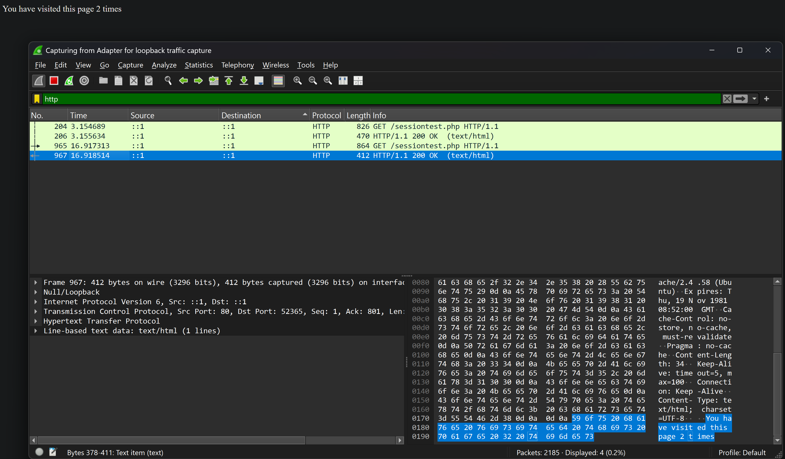
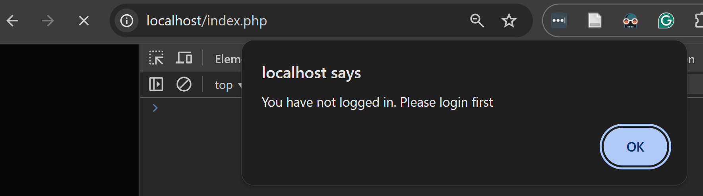

# WAPH-Web Application Programming and Hacking

## Instructor: Dr. Phu Phung

## Student

**Name**: Ian Cannon

**Email**: [mailto:cannoni1@udayton.edu](cannoni1@udayton.edu)

**Short-bio**: Ian Cannon interests in Reinforcement Learning for Autonomous Control. 

## Repository Information

Respository's URL: [https://github.com/Spiph/WebAppDev](https://github.com/Spiph/WebAppDev)

This is a public repository for Ian Cannon to store all code from the course. The organization of this repository is as follows.

### Lab 4

#### Task 1: Understanding Session Management in a PHP Web Application

##### 1.a. Deploy and test sessiontest.php

This shows my session is working

##### 1.b. Observe the Session-Handshaking using Wireshark (6 pts)

Here is the first session on Firefox:

The response assigns an id for the cookie, PHPSESSID:

You can see the second GET request now has a cookie:

You can see the server recognizes the session and replies without setting a new cookie

##### 1.c. Understanding Session Hijacking (2 pts)

#### Task 2: Insecure Session Authentication

##### 2.a. Revised Login System with Session Management (10 pts)

#### Task 3 

##### 3.a. Data Protection and HTTPS Setup (10 pts)

##### 3.b.

##### 3.c.

